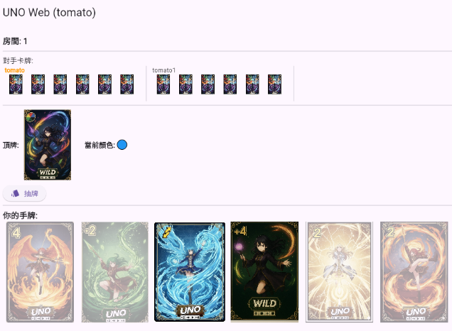
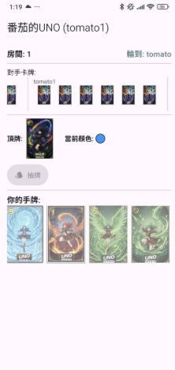

# UNO Web Game

一款使用 Flutter 開發、支援多人即時連線對戰的網頁版 UNO 卡牌遊戲。前端透過 WebSocket 與後端伺服器即時同步遊戲狀態，實現多人房間對戰、出牌、抽牌、特殊牌效果等完整 UNO 遊戲流程。

## 功能特色

- **帳號系統**：支援註冊與登入，登入後即可建立或加入房間。
- **房間機制**：可建立房間或輸入房間代碼加入他人房間，房間內顯示目前已連線玩家數量。
- **即時連線對戰**：透過 WebSocket 與伺服器即時雙向通訊，所有玩家的出牌、抽牌、回合切換會即時同步給房間內所有玩家。
- **完整 UNO 規則**：
  - 出牌規則驗證（顏色或數字相符、萬能牌可隨時出）
  - 抽牌與回合結束機制
  - 違規出牌懲罰（自動抽牌）
  - 勝負判定與通知
- **即時 UI 更新**：手牌、桌面當前牌、目前回合玩家、其他玩家手牌數量等狀態即時反映在畫面上。

## 畫面截圖

| 網頁版 | 行動裝置版 |
|---|---|
|  |  |

遊戲採用自訂插畫風格卡牌，畫面顯示對手卡牌數量、目前頂牌、當前顏色，以及自己的手牌，並支援跨平台（網頁／手機）同步遊玩。

## 系統架構

```
Flutter 前端（本 repo）  <---WebSocket--->  遊戲伺服器（後端）
```

前端負責畫面渲染與基本出牌規則前端驗證，實際遊戲邏輯（發牌、回合判斷、勝負判定、懲罰機制）由後端伺服器統一處理並透過 WebSocket 廣播給所有玩家，確保多人對戰狀態一致。

> 後端伺服器程式碼未包含於本 repo。

## 使用技術

- **Flutter / Dart**：跨平台 UI 開發（支援 Web / Android / iOS / Windows / macOS / Linux）
- **WebSocket（web_socket_channel）**：即時雙向通訊
- **JSON**：前後端訊息格式

## 環境需求

- Flutter SDK
- 一個可運行的 UNO 後端伺服器（提供 WebSocket 端點）

## 使用方式

1. 安裝相依套件：

   ```bash
   flutter pub get
   ```

2. 修改 `lib/main.dart` 中的 WebSocket 連線位址，指向你自己啟動的後端伺服器：

   ```dart
   channel = WebSocketChannel.connect(Uri.parse('wss://你的伺服器位址/uno/game'));
   ```

   > 開發測試時常用 [ngrok](https://ngrok.com/) 將本機伺服器暴露成公開網址，但 ngrok 的免費網址每次重啟都會改變，正式部署建議改用固定網域。

3. 執行專案：

   ```bash
   flutter run -d chrome   # 以網頁形式執行
   ```

## 遊戲流程

1. 註冊／登入帳號
2. 建立房間或輸入房間代碼加入
3. 房間內至少 2 名玩家即可開始遊戲
4. 依序出牌、抽牌，違規出牌會被自動懲罰抽牌
5. 率先出完手牌者獲勝，遊戲結束並顯示勝利訊息

## 專案結構

```
lib/
  main.dart        # 主程式：UI、WebSocket 連線與遊戲狀態管理
assets/cards/       # UNO 卡牌圖片資源
```

## 未來改進方向

- 將 WebSocket 連線位址改為可設定（環境變數或設定頁面），避免每次更換伺服器都要改原始碼
- 補上後端伺服器程式碼或說明文件，讓他人可以完整重現整個系統
- 加入遊戲畫面截圖或 demo 影片
- 增加重連機制，處理斷線後的狀態恢復

## 授權

本專案為課程／個人練習作品，僅供學習與作品集展示用途。
